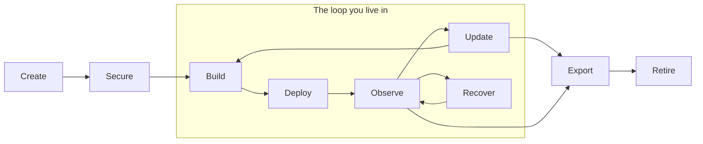

# Base Lifecycle

> The canonical lifecycle of a Base. Every CLI command and daemon capability maps onto one of these stages. If a proposed feature does not serve a stage, question whether it belongs at all.

A Base is a living thing the user owns. It is created, secured, lived in, maintained, and — if the user chooses — left intact. The stages are not strictly linear: the middle (Build, Deploy, Observe, Update, Recover) is a loop the user lives in for years; Create/Secure at the start and Export/Retire at the close are bounded. **Export and Retire are first-class stages**, not afterthoughts — they are where the [service-constitution.md](service-constitution.md) promise "you can leave anytime" becomes real.

## The nine stages

### 1. Create

The user brings infrastructure they own (or a local VM for testing) and a Base comes into existence. A user-owned Git repo and the `ownbase.yaml` control file are established as the source of truth.

- **Driven by:** the user, one command.
- **Daemon job:** reconcile (bootstrap the Base toward the repo).
- **CLI:** `ownbasectl create <base> [--remote user@host]`

### 2. Secure

The boring, critical hardening happens without the user having to understand it: firewall, automatic security updates, intrusion protection, TLS, no exposed databases. The Base is safe before anything is built on it.

- **Driven by:** the daemon.
- **Daemon job:** reconcile + watch.
- **CLI:** automatic at install; `ownbasectl security <base>` to inspect.

### 3. Build

The user (often via their AI) creates a service. The AI reads `OWNBASE.md` — which lists every existing service, the capability it provides, and how to reach it — and builds against those capabilities (auth, jobs, a database, storage) instead of reinventing them.

- **Driven by:** user + AI.
- **Daemon job:** explain (expose capabilities the AI can build against).
- **CLI:** none — this is editing `ownbase.yaml` and pushing to the Base's Forgejo.

### 4. Deploy

A service goes live. The daemon generates the boring deployment details (Quadlet units, Caddy routing, certificates) from the high-level description in `ownbase.yaml`.

- **Driven by:** the commit; the daemon reconciles.
- **Daemon job:** reconcile.
- **CLI:** none directly — triggered by `git push` to the Base; `ownbasectl status <base>` to confirm it landed.

### 5. Observe

The everyday stage. The Base watches itself and reports in plain language: healthy or not, what changed, what (if anything) deserves a glance.

- **Driven by:** the daemon.
- **Daemon job:** watch + explain.
- **CLI:** `ownbasectl status <base>`, `ownbasectl checkup <base>`.

### 6. Update

The Base stays current without the user becoming a maintainer. User services update by editing `ref:` in `ownbase.yaml` and committing. Core packages (Forgejo, Caddy) update via a dedicated command.

- **Driven by:** the user or their AI (editing `ref:`); `ownbasectl` for core packages.
- **Daemon job:** reconcile.
- **CLI:** `ownbasectl updates <base>` (drift report), `ownbasectl upgrade <base> [--apply]` (core packages).

### 7. Recover

When something breaks or is at risk, the Base heals: rollback, restart, rotate secrets, close unsafe ports, and — when a machine is lost — rebuild from the repo plus the latest verified backup. This is where the durability promise (see [architecture-principles.md](architecture-principles.md), principle 12) is made real: no data loss and a fast, rehearsed return.

- **Driven by:** the daemon (routine) or the user (rebuild).
- **Daemon job:** recover.
- **CLI:** `ownbasectl backup status <base>` (verify restorability), `ownbasectl restore <base> --repo ... --password ...` (rebuild).

### 8. Export

At any moment, the user can take everything — code, data, services, config, backups — out in standard, documented formats. This is not a special "offboarding" mode; export is always available because the source of truth already lives in the user's repo and data lives in open formats. See [uninstall.md](../uninstall.md).

- **Driven by:** the user.
- **Daemon job:** explain (where everything is).
- **CLI:** standard `git clone` / `pg_dump` / restic tooling — see [uninstall.md](../uninstall.md). Export must never require a special feature. See [service-constitution.md](service-constitution.md), rule 4.

### 9. Retire

The user can fully decommission a Base, or remove OwnBase while keeping the machine running. Because a Base is just Ubuntu they own, retiring OwnBase leaves a working system behind — nothing is held hostage.

- **Driven by:** the user.
- **Daemon job:** reconcile (clean removal).
- **CLI:** `ownbasectl delete <base>` (forget locally); see [uninstall.md](../uninstall.md) for fully removing OwnBase from the machine.

## Why the ends matter as much as the middle

Most platforms invest everything in Create through Update and treat Export and Retire as friction to discourage. OwnBase inverts that. A user who knows they can leave with everything intact, anytime, is a user who trusts the system with production workloads. The grace of the exit is the strength of the entrance.

## How to use this document

When evaluating a feature, name the stage it serves. If it serves none, it is probably out of scope. If it makes an early stage smoother by quietly making Export or Retire harder, it violates the foundation no matter how convenient it is.
