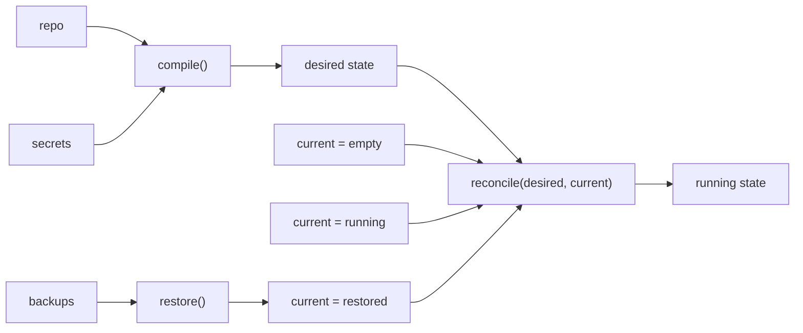

# The Reconstruction Model

> How a Base produces and recovers its running state. The single durable idea beneath the infrastructure — *a Base is a self-reconstructing computer* — and the model that makes install, update, recover, and rebuild one code path. Durable constraints, not an implementation spec.

## The one durable idea

Most self-hosting tools are *push-based*: a human runs a deploy from a laptop and the box's true state is never written down in one place. OwnBase inverts this into a single invariant that everything else serves.

**The ownership invariant.** Three artifacts are sufficient to reconstruct a working Base on any fresh machine, without OwnBase or any vendor:

> `reconstructable = (repo, secrets, backups)`

Own these three things and you own the computer.

**The operational model.** On a running Base, normal operation — install, update, drift correction — does not consume backups. The reconciler turns declared intent into running state:

```
desired  = compile(repo, secrets)
running  = reconcile(desired, current)
```

**Reconstruction** (new machine, data loss scenario) adds one prior step that restores the data before reconcile runs:

```
current  = restore(backups)
running  = reconcile(desired, current)   # same reconcile, different starting point
```

`reconcile` is one function in both paths. Install, update, recover, and rebuild are the same call from different starting conditions — not different code paths. Backups are a *prerequisite* for the rebuild path, not an input to every reconcile run.

Stated as the property being built: **a machine that can reconstruct itself from artifacts you own.** This makes the standard in [architecture-principles.md](architecture-principles.md) true by construction: delete OwnBase itself, and the repo plus the secrets plus the backups still reconstruct a working Base.

### Code is replaceable; data is not

The three inputs are not equal. The repo is *intent* and the secrets are *access*; both are reproducible. The backups are the **irreplaceable** half — the actual data nobody can regenerate. So the honest reading of the function is:

> `reconstruction = code (replaceable) + data (irreplaceable)`

This is why `ownbasectl backup status` reporting "restorable: true" is not a formality — it is the measured proof that the irreplaceable half is actually recoverable.

## Four operations, one code path



| Operation | `current` at reconcile time | backups used? | CLI |
|---|---|---|---|
| **Install** | empty machine | no | `ownbasectl create <base>` |
| **Update** | running machine + changed repo | no | commit to the repo (push) |
| **Recover (same machine)** | running machine + drift | no | automatic, or `ownbasectl checkup <base>` to see it |
| **Rebuild (new machine)** | `restore(backups)` → initial state | yes, as prerequisite | `ownbasectl restore <base> --repo ... --password ...` |

The consequence is the most important property in the model: **recovery is not a special mode, it is the default behavior of the system.** Install and rebuild share the same reconcile call; the only difference is what `current` looks like when it starts. Because the code path is shared, rehearsing recovery (drilled restores) validates the same logic that runs every install and update.

## What "reconcile" means

A reconciler is a **thermostat for a server.** The repo declares the target — these services, this config should be running. The daemon continuously reads what is *actually* running, compares it to the target, and makes the machine match: it starts what is missing, stops what should not be there, and repairs what drifted. The user never pushes a change or runs a deploy script by hand; they change the target (edit `ownbase.yaml`, commit) and the loop converges.

### The trigger is a commit, not a clock

```text
   commit -> hook -> compile -> diff -> apply
                                          |
   timer (drift backstop) -----> diff -> heal <-+
```

1. A commit lands in the Base's local source of truth. A hook signals the daemon — no polling, near-zero latency.
2. **Compile** `ownbase.yaml` into runtime artifacts.
3. **Diff** the desired runtime against what is actually running.
4. **Apply** the diff transactionally, health-checked, with rollback.

A **periodic timer is a backstop, not the primary loop.** It exists only to catch state that drifts *without* a commit (a crashed container, an expired cert) and to run scheduled work (backups, verified restores). Both paths call the same `reconcile`.

## The deterministic compiler

A single deterministic compiler turns the control file (`ownbase.yaml`) into the runtime artifacts the daemon applies:

```text
ownbase.yaml --+
secrets (enc)--+--> compile() --> runtime/   (generated; never hand-edited)
```

- **Pure and deterministic.** The same repo produces byte-identical runtime. Every image is built locally from the repo's source at a pinned `ref:`. Reproducibility *is* recoverability: `repo @ ref` → same Dockerfile → same build → same image.
- **Runnable without any cloud service, and previewable by an AI.** `ownbasectl plan` runs the compiler and shows the diff before anything is applied.
- **Single writer.** The compiler is the only thing that writes `runtime/`. A change in `runtime/` the compiler did not make is a drift/tamper signal.

## The source of truth lives on owned hardware

The ownership promise collapses if the authoritative repository lives on someone else's servers. So the authoritative copy of the user's repo lives **on the Base itself** — on the Base's own Forgejo instance. This is what makes the commit-driven loop above possible: a commit to the source of truth is an *internal* event, not a remote poll.

- **A filesystem bare repo is the irreducible truth.** The on-Base Git host is itself a reconciled service; to avoid a chicken-and-egg, the daemon holds a bare repo on the local filesystem first and the hosted Forgejo service becomes a remote of it.
- **External mirrors are optional and never authoritative.** A Base may push-mirror to an external host so tooling that assumes GitHub can work against it — but the authoritative copy stays on the Base and the update loop runs locally regardless.

This is the deepest expression of [architecture-principles.md](architecture-principles.md), principles 1 and 2: not just "Git is the source of truth," but *the source of truth is an artifact the user physically owns.*

## Secrets are an owned, recoverable, scoped asset

Secrets are the third input to the pure function, so they must be reconstructable alongside the repo:

- **Encrypted at rest**, decryptable only by a key held on the Base. See [ownbase-yaml.md](../ownbase-yaml.md), "Secrets".
- **Injected at start, never written as plaintext to disk.** The daemon decrypts and injects at container start.
- **Scoped at issue time.** Each service receives only the secrets it declares; no service can enumerate another's.

## Verified recovery is the spine, not a feature

The pure function exists so that recovery is the default. The proof that it works is **verified restore = actually restoring.** Periodically the daemon restores the latest backup into an ephemeral, isolated throwaway environment, runs integrity checks, and tears it down; `ownbasectl backup status` only reports "restorable" after that passes. Because recovery shares the install code path, this is a continuous drill, not a claim.

## The standard this model must meet

> Given only the repo, the secrets, and the latest verified backup — all artifacts the user physically owns — a working Base can be reconstructed on a fresh machine without OwnBase or any vendor:
> `restore(backups)` → `reconcile(compile(repo, secrets), current)`

Any design that breaks this property is wrong, no matter how convenient.
